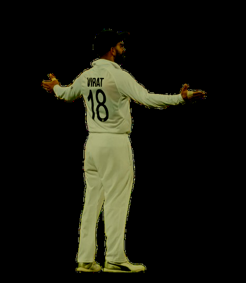
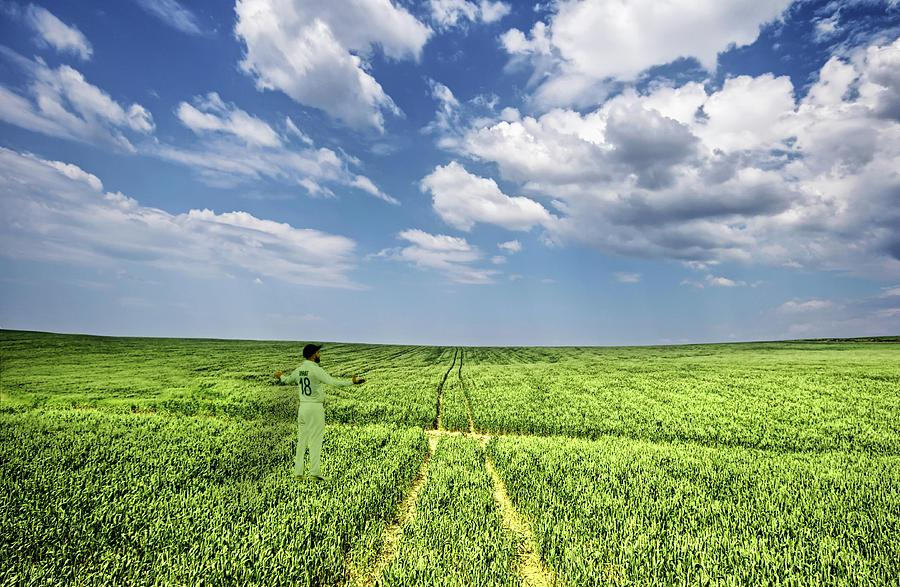
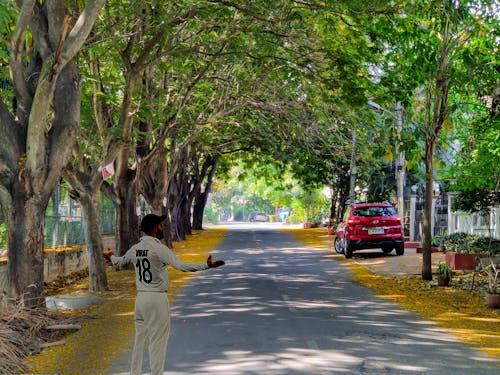
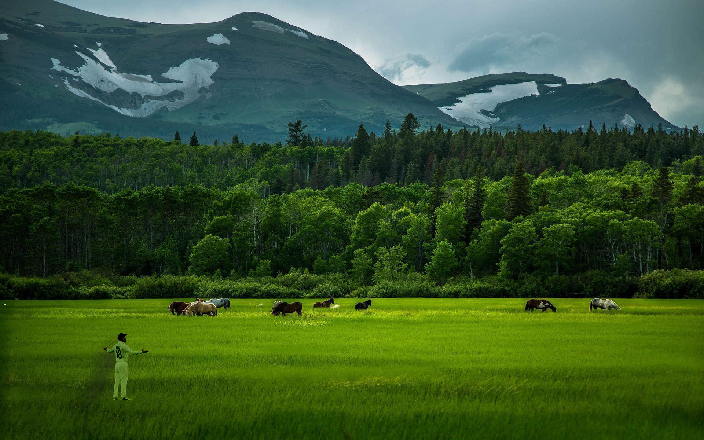
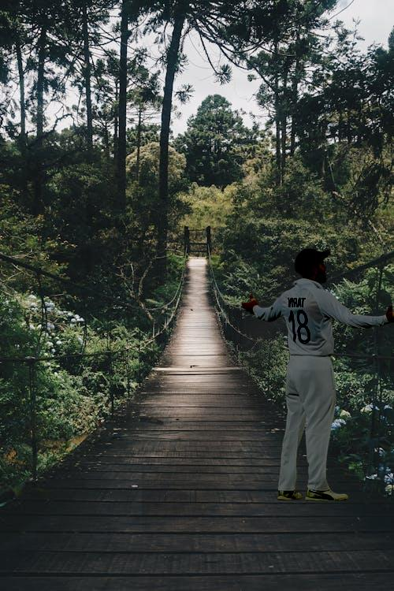
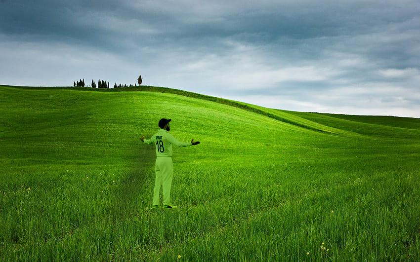
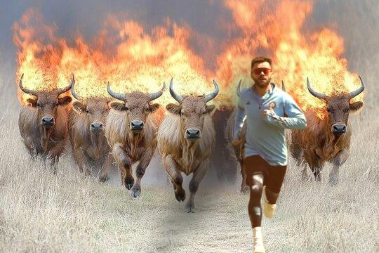

# Image Blending using Python(Scikit-learn)

## Step 1: Capturing and Preparing the Person's Image

A high-quality, front-view image of Virat Kohli is used as the starting point. It is captured in a well-lit environment for clarity. 
To remove the background of the image, I used the free website Remove BG (https://www.remove.bg/)
After removing the background, below are the images.

  <figure style="text-align:center; flex:1;">
    
    
  </figure>
  <figure style="text-align:center; flex:1;">
    
   
  </figure>

## Step 2: Colouring, Blending and Shadow Generation

(a) **Scale and Position**
Initially, the script scales the person's image to a realistic size in relation to the
scene. A scale factor (for instance, 0.3) is established, and the image is resized
using the resize () function with a high-quality LANCZOS filter to ensure clarity.
Subsequently, the person is assigned a fixed (x, y) coordinate tuple for
placement.
 
(b)  **Color correctness**
The foreground and background were captured under different lighting
conditions. To create harmony between them, the person's image underwent
colour correction. This goal is to make the person's colours match the
background's ambient light.
A crucial part of the procedure includes choosing and cropping a rectangular
area from the background image, specifically where the individual will be
placed.
Here is an example of the colour-corrected image.
 
 

 
 
(c) **Shadow Generation**
This step creates a realistic shadow based on the person's shape and the
manually determined light direction. A new, transparent RGBA image is created
to act as a canvas for the shadow. A dark, semi-transparent colour (40, 40, 40,
150) is pasted onto this canvas in the shape of the person, using the person's
alpha channel as a mask. This creates a silhouette.
To simulate the light direction, the shadow silhouette is skewed using
transform function with an AFFINE transformation. Finally, a Gaussian Blur is
applied to the shadow, softening its edges to create a more diffuse and natural
look, mimicking the soft shadows in the scene.
Here is an example of shadows generated,
 
 

 
 
## Step 3: Generating the Final Output
Final Image Composition: This step creates the final photorealistic image by
layering the generated elements in the correct order. A copy of the original
background image is made to function as the base layer. The generated and
blurred shadow is initially pasted onto this base layer. Following that, the
colour-corrected person is placed above the background and the shadow. This
layering guarantees that the person casts their shadow accurately. The final
image, with properly aligned lighting and shadows and seamlessly blended
colours, is saved to the disk.

## Results

 

 

 

 

 

 
.jpeg)
 
