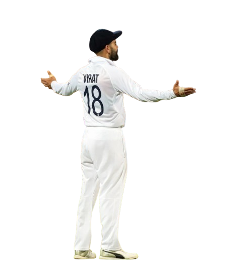
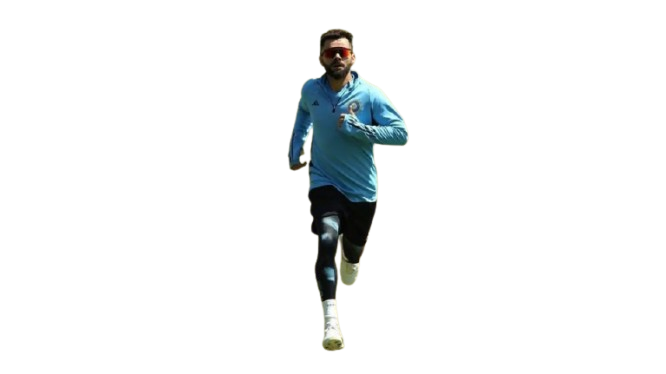

# Image Blending using Python(Scikit-learn)

## Step 1: Capturing and Preparing the Person's Image

A high-quality, front-view image of a Virat Kohli is used as the starting point. It is captured in a well-lit environment for clarity. 
To remove background of the image I used the free website Remove BG.(https://www.remove.bg/)
After removing the background below are the images.

  <figure style="text-align:center; flex:1;">
    
    <figcaption>Background Removed 1</figcaption>
  </figure>
  <figure style="text-align:center; flex:1;">
    
    <figcaption>Background Removed 2</figcaption>
  </figure>

